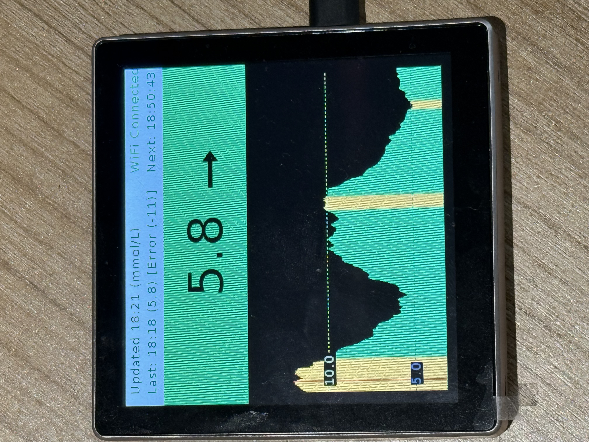
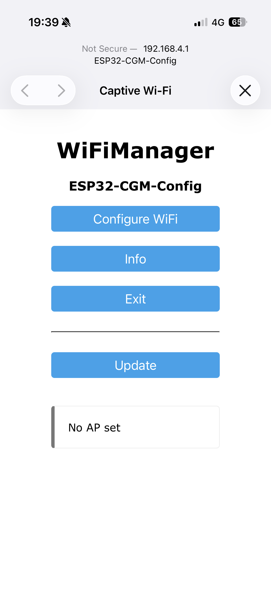
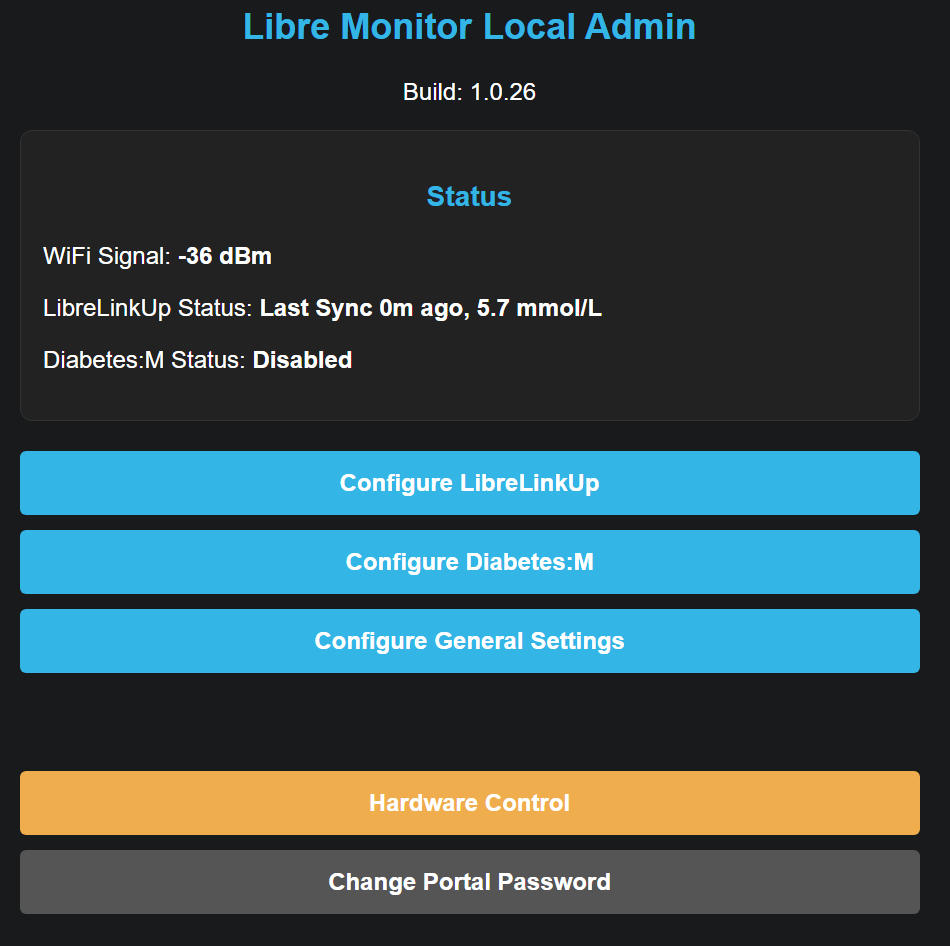
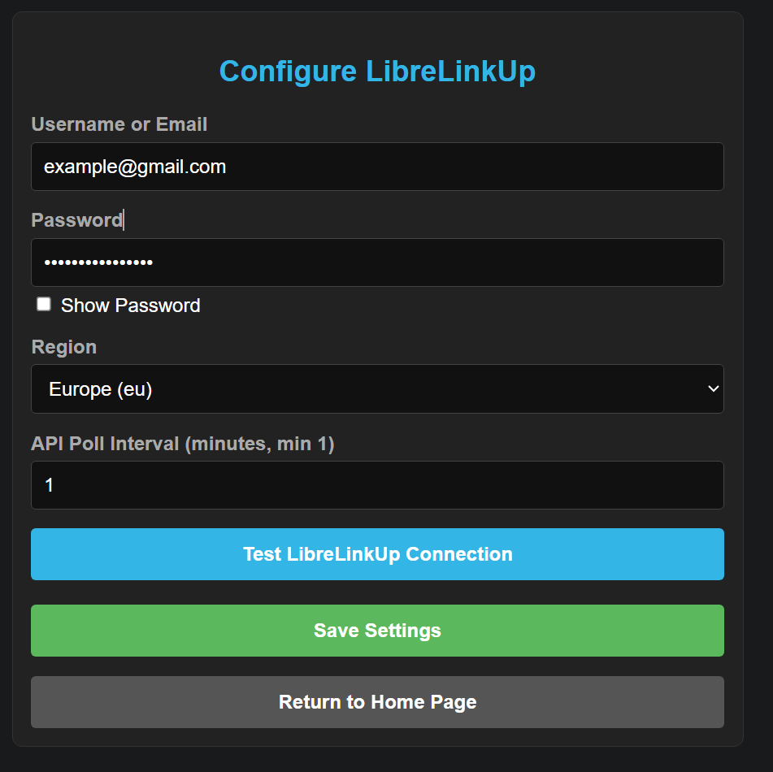
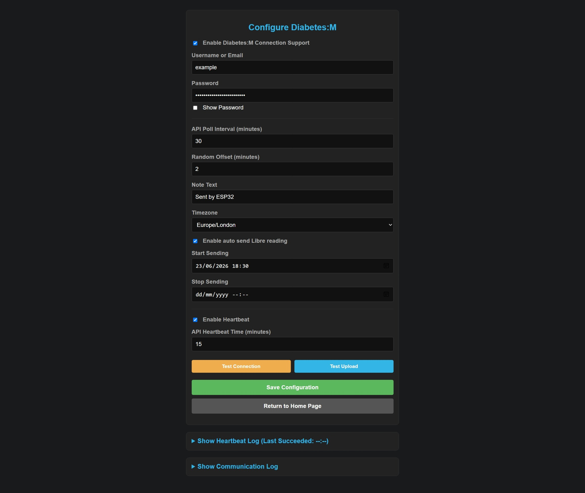
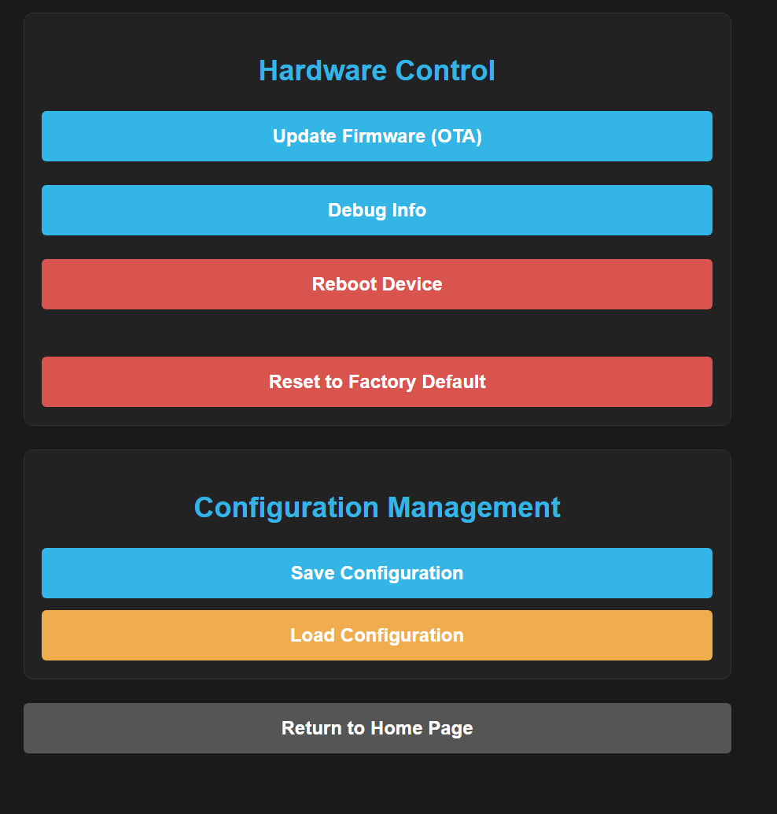

# ESP32 CGM Monitor

This project allows you to use a simple ESP32-S3 powered display to act as a Libre glucose monitor. Connects to your WiFi and driven by a LibreLinkUp account.

---

> [!NOTE]
> **Disclaimer**: I built this completely with Gemini Pro. Please don't ask me too many technical questions. I'm a late presenting Type 1, and built this solely for my own personal entertainment. Others may want to use it, so this is freely contributed in the hope that others can be inspired and build better things!
> 
> *Note: I'm in the UK so haven't really tested this with non-UK settings....*

---

---

## 📱 Device Screen Output

---

## 🌟 Key Features

*   **LibreLinkUp Follower Sync**: Periodically polls the LibreLinkUp follower API to display the latest glucose readings, trend arrows, and sync status.
*   **Diabetes:M Integration**:
    *   **Master Switch Toggle**: Turn connection support on/off. When off, all inputs and test fields are hidden and disabled to prevent unauthorized uploads.
    *   **Auto Send**: Automatically uploads new glucose readings to your Diabetes:M journal within configurable active hours.
*   **High-Density Contiguous Graph**: Displays 450 borderless, 1-pixel-wide adjacent vertical bars representing a rolling 15-hour lookup window of historical glucose data.
*   **Dynamic Client-Side Units Conversion**: Instantly switches between `mmol/L` and `mg/dL` on settings pages, automatically recalculating limit levels and rules while adjusting step increments.
*   **Custom Alert Messages**: Supports up to 10 user-defined conditional messages (using `>`, `<`, or `between` operators) to show customized status banners on the display.
*   **Web Administration Portal**: A secure, mobile-friendly web administration panel accessed directly over Wi-Fi, featuring:
    *   Separate menus for follower accounts, alerts/tolerances, and hardware commands.
    *   Password management (enforcing a secure custom password).
    *   Diagnostics page with network metrics, uptime, and communication logs.
    *   Configuration backup and restore (JSON import/export).
    *   OTA firmware updating.

---

## 🔌 Hardware Requirements

*   **Microcontroller**: ESP32-S3 (e.g. ESP32-S3-DevKitC-1 with 8MB flash).
*   **Display Controller**: ST7701 RGB TFT driver (480x480 resolution).
*   **Touch Controller**: GT911 capacitive touch panel.
*   **Display Library**: LovyanGFX configuration file for ST7701 & GT911.

> [!TIP]
> **Aliexpress Link**: Here's the hardware I used: [ESP32-S3 4-inch Smart Display (Aliexpress)](https://www.aliexpress.com/item/1005008214679682.html)

That hardware is "ready to go". It's got the controller, screen, everything. Just power it up, flash with the firmware and enjoy!

---

## 📸 Web Admin Portal Screenshots

Here is a visual walk-through of the portal pages:

### Wi-Fi Configuration (Captive Portal)

### Home Landing Page & Followers Configuration
| Admin Home Page | Configure LibreLinkUp |
| --- | --- |
|  |  |

### Alerts, Tolerances & Custom Rules

### Diabetes:M Integration

### Device Maintenance & Backups

---

## 📂 Project Organization

*   `src/main.cpp`: Main firmware source file containing WiFi logic, API integrations, web portal routes, NVS configuration, HMI drawing loops, and page templates.
*   `src/LGFX_ESP32S3_RGB_TFT_SPI_ST7701_GT911.h`: LovyanGFX graphics initialization driver for the target RGB TFT LCD screen and capacitive touch controller.
*   `platformio.ini`: PlatformIO project configuration outlining flash sizing, partitions, board parameters, and compilation dependencies (LovyanGFX, ArduinoJson, WiFiManager).
*   `firmware-release`: Binaries/firmware for flashing to ESP32.

